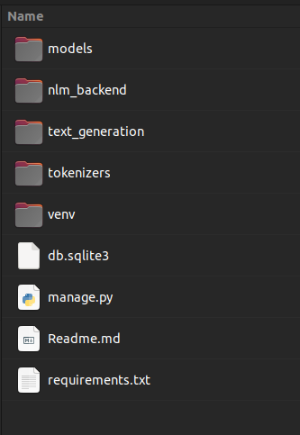
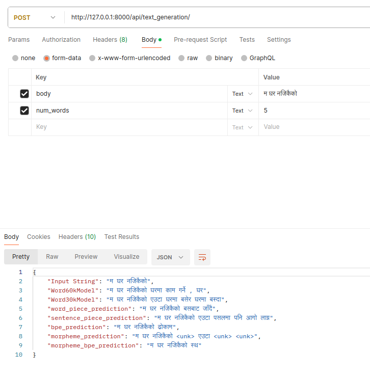

# Nepali Language Model For Text Generation

## Project Goals

* To develop nepali language model for text generation 
* Comparision of perplexity on model based on the tokenizers used
* Develop a spelling correction model using the language model

## Frontend and Backend
Frontent is developed using React and Backend is developed using django and django rest framework.

* [Backend](https://github.com/NirajanBekoju/Backend-Nepali-Text-Generation-Model)
* [Frontend](https://github.com/AAreLaa/NLP-UI)

## Steps to run locally
**Clone the repository**
```
https://github.com/NirajanBekoju/Backend-Nepali-Text-Generation-Model
```

**Create a virtual environment and activate it**
```
virtualenv venv
source ./venv/bin/activate
```

**Install all requirements from requirements.txt**
```
pip install -r requirements.txt
```

**Download the Text Generation Models. The folder structure will look like follow**
```
https://drive.google.com/drive/folders/1PyU5_Rt674a4qOYcGGApmnWFBUozraaK?usp=sharing
```



**Run Server**
```
python3 manage.py runserver
```

## API Testing with Postman


